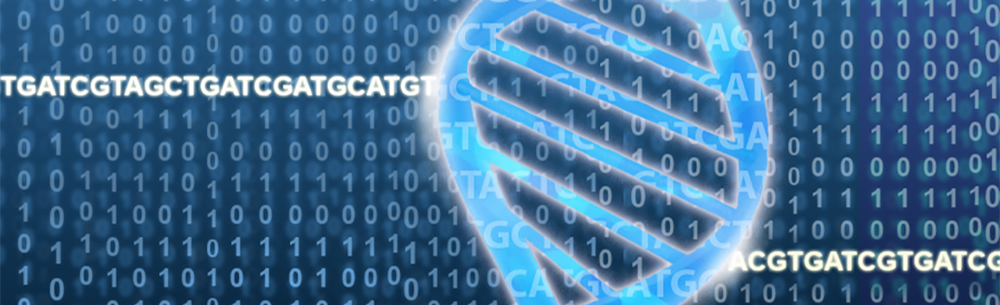
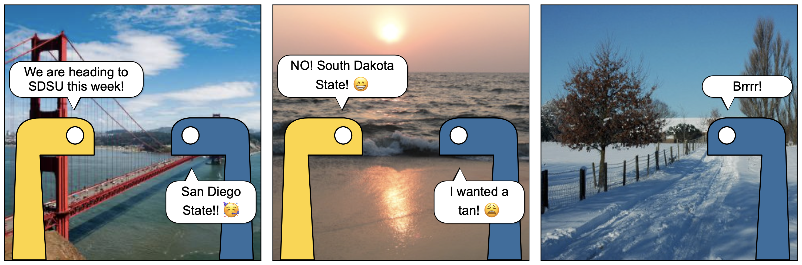

# BIO792 Next-Generation Sequencing Data Analysis

Source: https://science.institut-curie.org/platforms/next-generation-sequencing/

Slides and examples based on 
- Lecture 12 for the course *CSc487/687 Computing for Bioinformatics* taught during Fall 2015 at Missouri State University by Dr. Hui Liu : http://courses.missouristate.edu/huiliu/csc487/
- Biopython tutorial: http://biopython.org/

Source: https://pycomic.github.io
